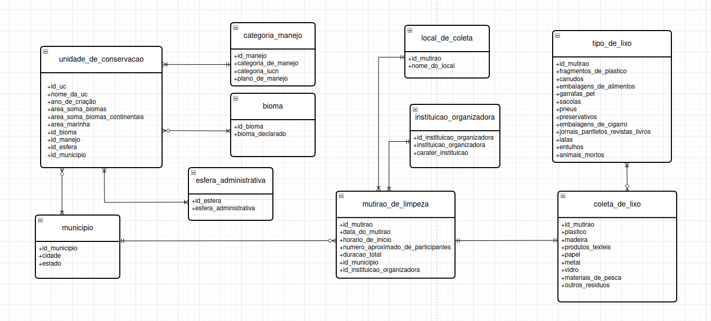
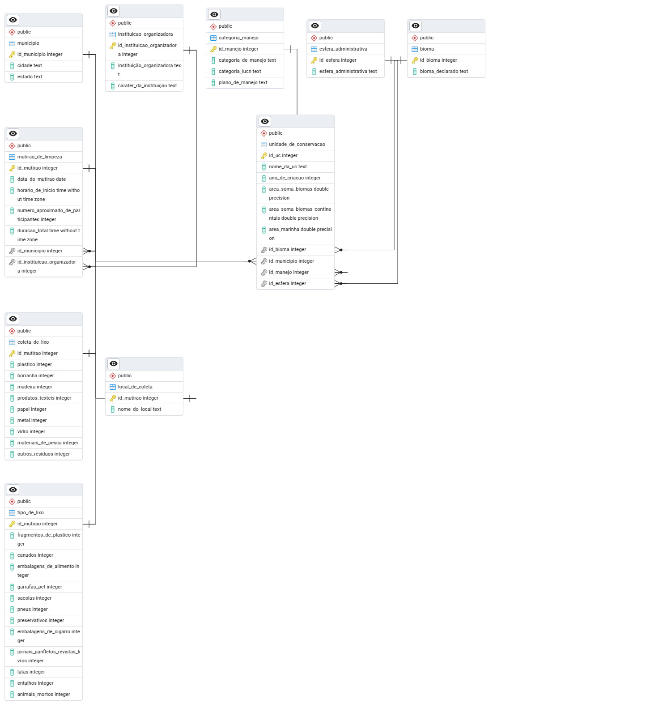

# MC536: Projeto de Banco de Dados

## Visão Geral do Projeto
Projeto desenvolvido por:  
- Gabriel dos Santos Souza - 269844  
- Pedro Gomes Ascef - 257086 
- Rafael Attilio Agricola - 249245

Este repositório contém o trabalho da disciplina MC536: Bancos de Dados. O projeto envolve o projeto, implementação e consulta a um banco de dados PostgreSQL para analisar relações entre:

- Unidades de conservação ambiental e ações de limpeza
- Volume e tipos de resíduos coletados em mutirões
- Eficiência de instituições organizadoras
- Distribuição geográfica (municípios e biomas) dos resíduos
- Evolução temporal das coletas

## Visão Geral do Esquema do Banco de Dados
O ponto central deste projeto é um banco de dados relacional estruturado para integrar diversos conjuntos de dados de forma coesa. A seguir, são apresentadas as visualizações dos modelos conceitual e relacional:

**Figura 1:** Modelo Conceitual (Diagrama ER)  
  

**Figura 2:** Modelo Relacional (Lógico)  
  

(O script SQL do Modelo Físico pode ser encontrado [aqui](modelos/modelo_fisico.sql)).

## Conjuntos de Dados
### Dados Originais
Os dados brutos foram obtidos do Portal de Dados Abertos do Governo, em específico do Ministério do Meio Ambiente e Mudança do Clima. Os arquivos originais usados estão no diretório `/datasets`:
- `cnuc_2022_01sem.csv`: Unidades de Conservação Ambiental.
- `dados_abertos_rios___limpos(1).csv`: Mutirões de Limpeza em Corpos Hídricos.

## Esquema do Banco de Dados

**Tabelas principais:**
- `unidade_de_conservacao`: Cadastro de áreas protegidas.
- `bioma`: Classificação dos biomas brasileiros.
- `categoria_manejo`: Tipos de manejo aplicáveis.
- `esfera_administrativa`: Níveis de gestão (Federal, Estadual, Municipal).
- `instituicao_organizadora`: Órgãos e entidades responsáveis (IBAMA, ICMBio, ONGs).
- `municipio`: Dados cadastrais de municípios.
- `tipo_de_lixo`: Classificação de resíduos.
- `mutirao_de_limpeza`: Registro de ações coletivas.
- `coleta_de_lixo`: Dados operacionais.
- `local_de_coleta`: Métricas por ponto de coleta.

Relacionamentos por chaves estrangeiras ligam tabelas fato às dimensões.


## Tecnologias Utilizadas
- **Banco de Dados:** PostgreSQL.
- **Linguagem:** Python 3.
- **Bibliotecas:**
  - `psycopg2`: Adaptador PostgreSQL para Python.
  - `pandas`: Manipulação e análise de dados.
  - `jupyterlab`/`notebook`: Para executar arquivos `.ipynb`.
- **Ferramentas:** pgAdmin 4 (gerenciamento do banco e geração de DER).

## Estrutura do Projeto
```plaintext
Projeto-MC536/
│
├── datasets/                  # Dados originais
│   ├── cnuc_2022_01sem.csv
│   ├── dados_abertos_rios___limpos(1).csv
│
├── modelos/                    # Modelos do banco
│   ├── modelo_conceitual.png
│   ├── modelo_fisico.sql
│   ├── modelo_relacional.pgerd
│   └── modelo_relacional_imagem.jpeg
│
├── resultados/                  # Resultados das consultas
│   ├── query_1.csv
│   ├── query_2.csv
│   ├── query_3.csv
│   ├── query_4.csv
│   └── query_5.csv
│
├── tratamento_e_analise_de_dados/                
│   ├── criacao_codigo_completo.ipynb
│   ├── criacao_populacao_e_queries.ipynb
│   ├── manipulacao_e_tratamento_dados.ipynb
│            
└── README.md                            
```

## Configuração e Uso
### Pré-requisitos
- **Python 3.x**: Certifique-se de que o Python 3 está instalado.
- **PostgreSQL**: Instale e execute um servidor PostgreSQL.
- **pip**: Instalador de pacotes do Python.
- **Bibliotecas Python necessárias**: Instale as bibliotecas necessárias com o seguinte comando:
 ```bash
 pip install jupyterlab psycopg2-binary pandas 
 ```
- **Clonar o Repositório**: Clone este repositório para sua máquina local:
 ```bash
 git clone <repository-url>
 cd Projeto-MC536
 ```
- **Arquivos CSV**: Verifique se os arquivos CSV estão presentes no diretório `/datasets`.
---
## Configuração do Banco de Dados
### 1. Criar Banco de Dados
Utilize o `psql` ou uma ferramenta como o `pgAdmin4` para criar um novo banco de dados PostgreSQL.. O
```sql
CREATE DATABASE nome_do_seu_banco;
```
### 2. Configurar Conexão
Abra o notebook `codigo_completo.ipynb`. Localize os parâmetros de conexão com o banco
de dados no início do notebook e atualize a variável `db_name` e `password` conforme o nome do seu banco e a sua senha do PostgreSQL.
```python
# Substitua "password" pela sua senha real do PostgreSQL e "dbname" pelo nome do seu banco !!
import psycopg2 
from psycopg2 import sql
conn = psycopg2.connect(dbname = "", user = "postgres", password = "", host = "localhost", port = "5432")
cursor = conn.cursor()
```
---
## Execução do Código
### 1. Iniciar o Jupyter
Navegue até o diretório do repositório no terminal e execute:
```bash
jupyter lab
# ou
jupyter notebook
```
### 2. Abrir o Notebook
Abra o notebook `codigo_completo.ipynb` no Jupyter.
### 3. Executar as Células
Execute as células do notebook sequencialmente. O notebook irá:

1. Criar as tabelas com o auxílio do pandas, preparando-as para inserção no banco de dados.
2. Estabelecer conexão com o banco de dados.
3. Executar o script SQL responsável pela criação das tabelas e definição das restrições.
4. Carregar os dados dos DataFrames gerados no código para as respectivas tabelas do banco.
5. Executar 5 consultas SQL predefinidas e exibir os resultados no notebook (utilizando pandas DataFrames).

---
## Pré-processamento dos Dados

Os notebooks `criacao_populacao_e_queries.ipynb` e `manipulacao_e_tratamento_dados.ipynb` separam as etapas de pré-processamento dos dados e a parte de criação/população do banco de dados. A execução desses notebooks é opcional, pois todo o processo está unificado em `codigo_completo.ipynb`.

---
## Análises e Consultas
As análises principais são realizadas via consultas SQL incorporadas no notebook
`database_creation_and_queries.ipynb`. As cinco consultas investigam relações entre os dados, incluindo:

1. **Proporção de Unidades de Conservação vs. Lixo Extraído por Cidade**  
   Analisa a relação entre áreas protegidas e volume de resíduos coletados em mutirões, identificando padrões de geração de lixo por município.

2. **Proporção de Lixo Extraído vs. Unidades de Conservação por Estado**  
   Compara o volume de resíduos coletados com a quantidade de áreas protegidas em cada estado, revelando padrões regionais.

3. **Análise de Resíduos por Bioma**  
   Segmenta os tipos e quantidades de lixo coletado por bioma (Amazônia, Cerrado, etc.), destacando impactos ambientais específicos.

4. **Eficiência das Instituições Organizadoras (Público vs. Privado)**  
   Avalia o desempenho de organizações (ONGs, órgãos públicos) baseado no volume total de resíduos coletados nos mutirões.

5. **Eficiência Temporal dos Mutirões de Limpeza**  
   Mede a produtividade das ações por período (lixo/minuto, resíduos/participante) e compara sazonalidades.
---
## Resultados
Os resultados gerados pelas 5 consultas analíticas são salvos como arquivos CSV no diretório `/resultados`:
- `query_1.csv`
- `query_2.csv`
- `query_3.csv`
- `query_4.csv`
- `query_5.csv`
